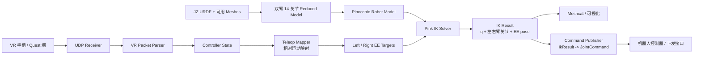
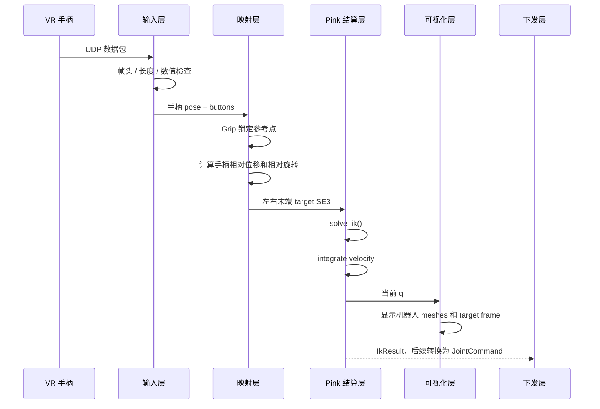
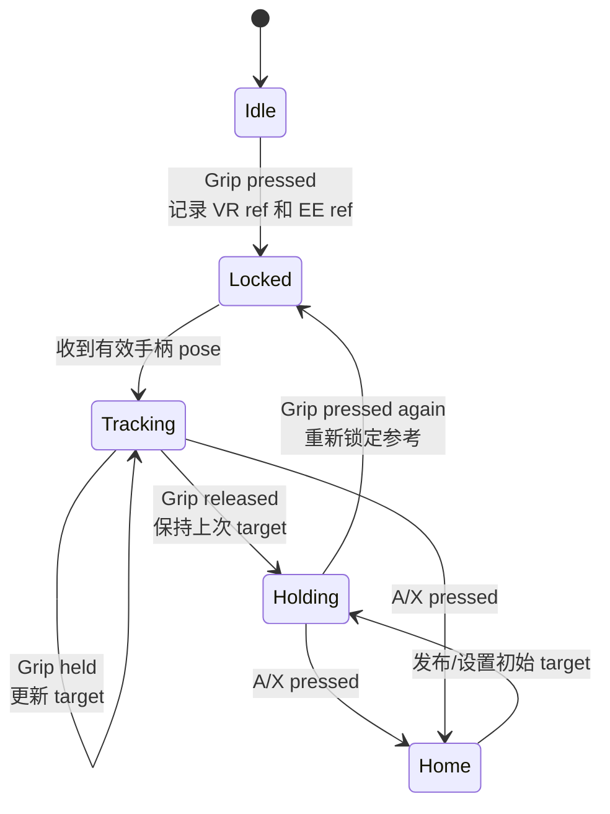
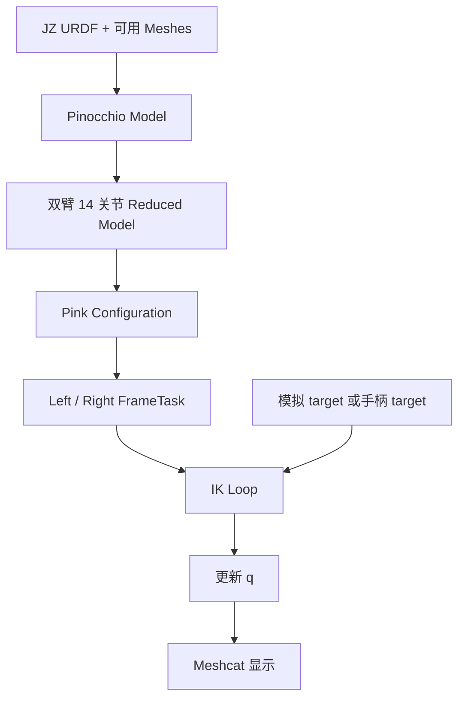
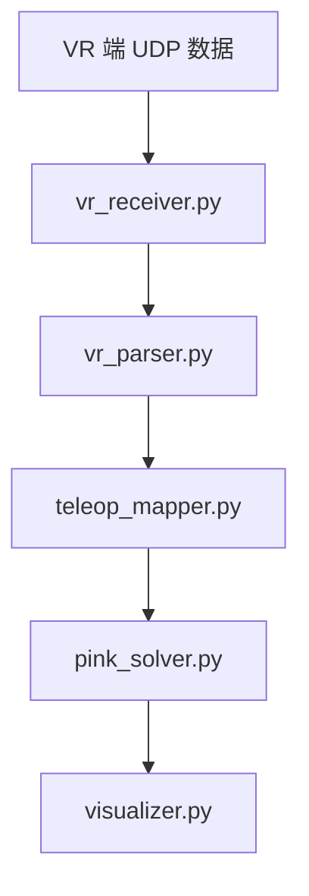
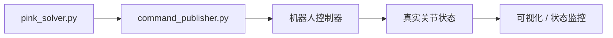
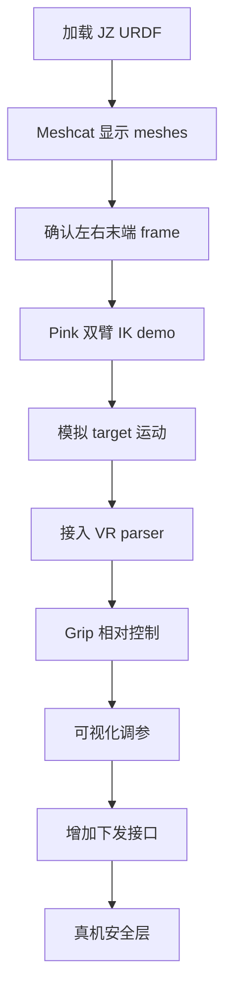

# light_teleop 架构与原理设计

## 1. 目标

`light_teleop` 的目标是做一套更轻量的遥操作程序。它不继续沿用
`teleop_vr_recv-main` 里较重的 C++ ROS 2 主链路，而是只复用其中已经
验证过的手柄接收和解析思路，把后面的运动结算全部改为 Pink。

最终希望形成一条清晰的链路：

```text
VR 手柄输入
  -> 轻量输入解析
  -> 手柄相对运动映射
  -> Pink 逆运动学结算
  -> 可视化验证
  -> 后续下发关节命令
```

第一阶段只做可视化和结算验证，不直接控制真机。先让机器人双臂在可视化中
稳定跟随模拟 target；第二阶段接入手柄后，再验证 Grip 相对控制手感。

当前控制范围明确限定为**双臂 14 个关节**：

```text
left_joint1..left_joint7
right_joint1..right_joint7
```

腰、头、夹爪不参与 Pink 逆运动学。夹爪开合由独立链路控制，`light_teleop`
只保留夹爪字段的解析兼容，不把夹爪关节放进 IK 结算或 14 关节下发命令。

阶段口径统一如下：

```text
第一阶段 = M1-M3：模型加载 + Pink 双臂 IK + Meshcat 可视化
第二阶段 = M4-M5：手柄输入 + Grip 相对遥操作
第一版   = M1-M6：可视化遥操作 + dry-run 下发接口，不接真机
真机版   = M7-M8：安全层 + 真实下发
```

## 2. 设计原则

1. **轻量优先**  
   只保留遥操作闭环必须的模块：手柄输入、目标映射、IK 结算、可视化。
   不在第一版引入复杂配置系统、ROS service、多机器人 namespace、真机下发
   和复杂安全策略。

2. **复用已验证部分**  
   复用 `teleop_vr_recv-main` 中和手柄相关的协议、按钮语义、UDP 接收逻辑和
   输入安全检查思路，避免重新定义 VR 端数据格式。

3. **替换后端结算**  
   原版中 `teleop_vr_recv-main` 的后端主要发布关节命令或笛卡尔
   `target_pose`。在 `light_teleop` 中，笛卡尔目标位姿不再交给外部 IK，
   而是直接交给 Pink 做微分逆运动学结算。

4. **先可视化，后下发**  
   先通过 URDF + 可用 meshes 在可视化中验证关节方向、末端 frame、IK 权重和
   手柄操作手感。下发模块等模型和 IK 链路稳定后再接。当前 URDF 中存在缺失
   mesh 引用，因此模型加载必须支持“运动学优先、几何可降级”的调试路径。

5. **模块边界清楚**  
   每个模块只处理一类问题：输入模块不做 IK，IK 模块不关心 UDP，发布模块
   不改变运动学结果。

## 3. 依赖来源

### 3.1 jz_descripetion-main

用途：提供机器人模型资产。

说明：`jz_descripetion-main` 是当前仓库目录名，虽然拼写不是
`description`，实现和文档都应按现有目录名引用，避免路径断掉。

使用内容：

- `robot_urdf/urdf/robot urdf.10.8.SLDASM.urdf`
- `robot_urdf/meshes/visual`
- `robot_urdf/meshes/collision`
- 关节命名：`left_joint1..7`、`right_joint1..7`
- 可选参考：`display.launch.py` 和 `simple_joint_state_gui.py`

已知资产问题：

- 当前 URDF 引用了若干夹爪相关 STL，例如 `gripper_base_link.STL`、
  `narrow*_Link.STL`、`wide*_Link.STL`。
- 这些 STL 在当前 `meshes/visual` 和 `meshes/collision` 目录中并不完整。
- 因此第一阶段的 M1 验收应先区分“运动学模型加载成功”和“完整几何显示成功”。

处理策略：

```text
优先目标：加载运动学模型，完成双臂 14 关节 IK。
几何显示：显示当前可用 meshes；缺失 mesh 时记录 warning 并降级。
完整显示：只有补齐 STL、修正 URDF mesh 路径或加入占位 mesh 后才算通过。
```

在 `light_teleop` 中，它主要负责回答三个问题：

```text
机器人有哪些关节？
每个 link 和 joint 的运动学关系是什么？
可视化应该加载哪些 mesh？
```

### 3.2 teleop_vr_recv-main

用途：复用手柄输入部分的设计。

使用内容：

- UDP 数据包格式
- VR 手柄 pose 字段定义
- 手柄按钮字段定义
- Grip 锁定参考点的交互语义
- A/X 回初始位姿的交互语义
- 输入合法性检查思路

不继续复用的部分：

- C++ ROS 2 大节点结构
- `target_pose` 发布链路
- 原有工作空间球心 topic 机制
- 原有配置系统和 glog/gflags/toml11 依赖
- 原有“后端结算/转发”逻辑

### 3.3 reference/pink-main

用途：作为新的运动结算核心。

使用内容：

- Pinocchio 读取 URDF
- Pink `Configuration`
- Pink `FrameTask`
- Pink `PostureTask`
- Pink `solve_ik`
- Meshcat 可视化接口
- 关节限位和速度限制支持

Pink 不是一次性全局 IK 求解器，而是微分逆运动学求解器。它每一帧根据当前
关节状态和目标末端位姿求一个速度，再积分得到新的关节状态。

## 4. 总体架构



这张图表达的是最终结构。第一阶段只实现到 `Viz`，`Publisher` 和 `Robot`
作为后续接口预留。

## 5. 运行时数据流



第一阶段 `Pub` 不启用。它只表示后续可接的下发出口。

## 6. 模块划分

建议目录结构：

```text
light_teleop/
  docs/
    architecture.md
    plan.md
    执行.md
  light_teleop/
    __init__.py
    config.py
    model_loader.py
    pink_solver.py
    visualizer.py
    vr_receiver.py
    vr_parser.py
    teleop_mapper.py
    command_publisher.py
    main.py
```

### 6.1 vr_receiver.py

职责：

- 监听 UDP 端口。
- 接收 VR 端发送的数据包。
- 不做运动学、不做 Pink、不做可视化。

输入：

```text
UDP bytes
```

输出：

```text
raw packet bytes
```

### 6.2 vr_parser.py

职责：

- 解析 `teleop_vr_recv-main` 使用的 VR 数据协议。
- 检查帧头、长度、数值范围。
- 把原始 bytes 转成结构化手柄状态。

输出数据建议包含：

```text
left_controller_pose
right_controller_pose
headset_pose
left_input
right_input
left_gripper
right_gripper
```

其中 controller pose 使用：

```text
position = [x, y, z]
rotation = [qx, qy, qz, qw]
```

controller input 使用：

```text
trigger
grip_button
primary_button
secondary_button
menu_button
joystick_x
joystick_y
```

### 6.3 teleop_mapper.py

职责：

- 把 VR 手柄相对运动映射为机器人末端目标。
- 处理 Grip 锁定、松开保持、A/X 回初始位姿。
- 处理坐标轴映射、比例缩放、简单限速。

核心原则：

```text
手柄不直接给机器人绝对目标。
手柄只提供相对增量。
```

当 Grip 按下时：

```text
记录当前 VR 手柄位姿 vr_ref
记录当前机器人末端位姿 ee_ref
```

当 Grip 持续按住时：

```text
vr_delta = current_vr_pose - vr_ref
ee_target = ee_ref + mapped(vr_delta)
```

当 Grip 松开时：

```text
保持上一次 ee_target
```

这样可以避免 VR 坐标系和机器人坐标系没有精确绝对标定时发生跳变。

### 6.4 pink_solver.py

职责：

- 接收已加载的 JZ 机器人模型。
- 构建或使用只包含双臂 14 个关节的 reduced model。
- 创建 Pink `Configuration`。
- 创建左右手末端 `FrameTask`。
- 创建 `PostureTask` 作为双臂姿态正则。
- 每帧调用 `solve_ik` 得到关节速度。
- 对速度积分得到新的关节配置。
- 输出 IK 结果，不生成下发命令。

输入：

```text
left_target_to_world
right_target_to_world
dt
```

输出：

```text
IkResult
q
left_joint_positions
right_joint_positions
left_ee_current_pose
right_ee_current_pose
```

### 6.5 visualizer.py

职责：

- 用 Meshcat 显示 URDF meshes。
- 显示当前机器人状态。
- 显示左右末端 target frame。
- 显示当前左右末端 frame。

可视化层只展示结果，不参与运动学结算。

### 6.6 command_publisher.py

职责：

- 后续把 Pink 输出的 `IkResult` 转换为下发格式。
- 第一阶段可以不实现或只保留空接口。
- 不反向影响 Pink 结算，也不修改 IK 结果。

未来可能支持：

```text
ROS 2 JointState
Float64MultiArray
自定义控制器接口
真机 SDK 下发接口
```

## 7. Pink 结算原理

Pink 基于 Pinocchio 机器人模型做微分逆运动学。它不直接求“目标对应的唯一
关节角”，而是在当前关节状态附近求一个最合适的关节速度。

当前状态：

```text
q(t)
```

目标：

```text
left_ee(q)  -> left_target
right_ee(q) -> right_target
```

Pink 每帧求解：

```text
v = solve_ik(configuration, tasks, dt, solver=solver)
```

然后积分：

```text
q(t + dt) = integrate(q(t), v, dt)
```

其中 `tasks` 至少包含：

```text
left_ee_task
right_ee_task
posture_task
```

QP solver 默认选择策略：

```text
优先使用 daqp。
如果 daqp 不可用，使用 qpsolvers.available_solvers[0]。
如果没有可用 solver，启动时报错，不进入主循环。
```

### 7.1 FrameTask

`FrameTask` 约束某个机器人 frame 跟踪目标位姿。

本项目建议使用：

```text
left_arm_link9  或后续新增 left_ee
right_arm_link9 或后续新增 right_ee
```

当前默认控制末端固定为 `left_arm_link9/right_arm_link9`，它们对应末端
法兰盘 / 工具基座。`left_arm_link10/right_arm_link10` 对应相机或附属挂载点，
只作为可视化对比 frame，不作为默认 IK 控制 TCP。

M1/M2 仍然需要可视化候选 frame，确认法兰盘、相机挂载点和夹爪视觉中心之间的
关系。

如果发现夹爪视觉中心和控制点不一致，应在 URDF 或运行时模型中添加两个固定
末端 frame：

```text
left_ee
right_ee
```

而不是在代码中到处写偏移补偿。

### 7.2 PostureTask

`PostureTask` 给机器人一个偏好的默认姿态。它不是主任务，而是正则项。

作用：

- 减少多解情况下的随机姿态。
- 降低手臂奇怪折叠的概率。
- 在左右手目标冲突或不可达时，让姿态更稳定。

### 7.3 关节限制

Pink/Pinocchio 会读取 URDF 中的关节限制。结算时应保留：

- configuration limit
- velocity limit

第一阶段不建议关闭限制。可视化阶段也应该尽早暴露限位问题。

### 7.4 参与 IK 的关节范围

第一阶段只允许双臂 14 个关节参与 IK：

```text
left_joint1..left_joint7
right_joint1..right_joint7
```

腰、头、夹爪必须固定。推荐实现方式是构建 Pinocchio reduced model，只保留
左右臂 14 个关节，把其他关节锁定在初始姿态。

不推荐第一版直接用完整模型做 IK。如果临时使用完整模型，必须显式约束非双臂
关节，例如速度限制为 0 或每帧固定回初始值。仅靠 `PostureTask` 不等于锁死
关节，因为它只是正则项。

## 8. 手柄相对映射原理

原版 `teleop_vr_recv-main` 中比较值得保留的是 Grip 锁定参考点的交互方式。
这个方式天然适合遥操作。

### 8.1 状态机



### 8.2 映射公式

位置映射：

```text
vr_delta = vr_position_current - vr_position_ref
robot_delta = axis_map(vr_delta) * scale_factor
ee_target_position = ee_ref_position + robot_delta
```

姿态映射：

```text
vr_delta_rotation = vr_rotation_current * inverse(vr_rotation_ref)
robot_delta_rotation = map_rotation_delta(vr_delta_rotation, axis_mapping, tool_offset)
ee_target_rotation = ee_ref_rotation * robot_delta_rotation
```

实际实现时还需要：

- 四元数归一化。
- 四元数同向处理，避免符号翻转导致跳变。
- 不能直接交换四元数的 x/y/z 分量来做姿态映射。
- Python 版必须复刻或重新定义原 C++ 的旋转矩阵映射算法，并加入左右手工具
  姿态偏置 `tool_offset`。
- 目标位置限速。
- 目标姿态角速度限速。

姿态映射验收必须包含单轴旋转测试：

```text
绕 VR X 正向旋转时，机器人末端姿态方向符合预期。
绕 VR Y 正向旋转时，机器人末端姿态方向符合预期。
绕 VR Z 正向旋转时，机器人末端姿态方向符合预期。
左右手 tool_offset 分别验证。
```

## 9. 坐标系

VR 坐标系和机器人 `base_link` 坐标系不一定一致，因此必须有轴映射。

初始建议沿用原版配置中的思路：

```text
VR X 右  -> base -Y
VR Y 上  -> base +Z
VR Z 前  -> base +X
```

可以表示为：

```text
axis_mapping = [-2, 3, 1]
```

含义：

```text
VR x -> robot -y
VR y -> robot +z
VR z -> robot +x
```

后续如果发现手柄移动方向和机器人不一致，只调整 `teleop_mapper.py` 中的
坐标映射，不改 Pink，也不改 UDP parser。

## 10. 第一阶段最小闭环

第一阶段只做模型、Pink 和可视化闭环，不接手柄，不做下发：



验收标准：

1. URDF 能被 Pinocchio 正确加载。
2. 能检查并报告缺失 mesh；缺失几何不阻塞双臂 IK 验证。
3. Meshcat 至少能显示当前可用 meshes 和 target/current frame。
4. 能找到并可视化左右 TCP 候选 frame。
5. 双臂 14 个关节存在，其他关节固定。
6. 给定左右末端 target 后，Pink 能稳定解算。
7. 左右臂在可视化中能跟随 target。
8. 关节方向和 URDF 显示一致。
9. 不接真机、不做下发。

## 11. 第二阶段接入手柄

第二阶段接入原版手柄协议：



验收标准：

1. 能稳定收到 UDP 包。
2. Grip 按下后开始跟随。
3. Grip 松开后保持末端目标。
4. 再次按下 Grip 时从当前位置继续。
5. A/X 可以回到配置好的初始姿态。
6. 手柄移动方向符合预期。
7. 可视化中没有明显跳变。

## 12. 第三阶段下发

第三阶段再增加下发模块：



下发前必须增加：

- Grip 使能。
- 急停入口。
- 关节位置限幅。
- 关节速度限幅。
- 目标位姿限速。
- 通信超时保护。
- 控制频率限制。
- 真机反馈检查。

下发格式后续再定，第一版只需要让 `command_publisher.py` 接收 Pink 输出的
关节结果，不反向影响 IK 逻辑。

## 13. 和原版 teleop_vr_recv-main 的区别

| 项目 | teleop_vr_recv-main | light_teleop |
| --- | --- | --- |
| 语言 | C++ ROS 2 | Python 优先 |
| 输入 | UDP VR 数据 | 复用 UDP VR 数据 |
| 后端 | 发布关节命令或 target_pose | Pink 直接做 IK |
| 可视化 | 依赖外部 ROS/RViz | 第一阶段 Meshcat |
| 配置 | TOML + glog/gflags | 第一阶段简单参数 |
| 控制方式 | 转发/坐标转换为主 | 手柄相对映射 + IK |
| 真机下发 | 不在该节点内完成 | 后续单独模块 |
| 目标 | 功能完整 | 轻量、可调、先验证 |

## 14. 关键风险

### 14.1 URDF mesh 路径

Pinocchio 加载 URDF 时必须能解析 `package://jz_robot_description/...`。
当前包名来自 `jz_descripetion-main/robot_urdf/package.xml`，包路径是：

```text
jz_descripetion-main/robot_urdf
```

实现时必须用加载验证脚本确认：

```text
package://jz_robot_description/meshes/...
```

能解析到当前仓库中的真实文件。由于当前夹爪相关 STL 缺失，M1 必须先输出
缺失列表，并选择补齐、替换或降级运行。

### 14.2 末端 frame 选择

如果选错 `FrameTask` 的 frame，IK 仍然可能能动，但手柄控制点和视觉上的夹爪
中心会不一致。当前默认控制 frame 是法兰盘：

```text
left_arm_link9
right_arm_link9
```

相机挂载点只作为对比检查：

```text
left_arm_link10
right_arm_link10
候选 left_ee/right_ee
```

后续如果需要真正的工具中心点，根据可视化效果新增固定 TCP：

```text
left_ee
right_ee
```

### 14.3 初始姿态

Pink 是局部 IK，初始姿态很重要。需要给一个合适的初始关节角，避免一启动就
贴近限位。

### 14.4 双臂任务权重

左右手同时控制时，如果 `FrameTask` 和 `PostureTask` 权重不合理，可能出现：

- 一只手跟得快，另一只手跟得慢。
- 手臂姿态不自然。
- 接近限位时抖动。

第一版应保持任务数量少，先调清楚两个末端任务和一个姿态任务。

### 14.5 非双臂关节误参与 IK

完整 URDF 中包含腰、头、夹爪等关节。如果直接把完整模型交给 Pink，IK 可能
会动用这些自由度。第一版必须使用 reduced model 或显式锁定非双臂关节。

### 14.6 真机安全

可视化通过不代表可以直接下发真机。真机下发必须单独做安全层，不能把
可视化 demo 的输出直接接到执行器。

## 15. 推荐开发顺序



当前只需要先完成到：

```text
Pink 双臂 IK demo + 可视化调参
```

手柄接入可以作为第二个小里程碑。

## 16. 总结

`light_teleop` 的核心思路是：

```text
用 jz_descripetion-main 提供机器人模型和 meshes。
用 teleop_vr_recv-main 提供手柄协议和交互经验。
用 Pink 替换原有后端结算。
先在可视化中验证，再增加下发。
```

这套方案把“输入、映射、结算、可视化、下发”拆开，能更快定位问题，也便于
后续逐步接入真实机器人。
